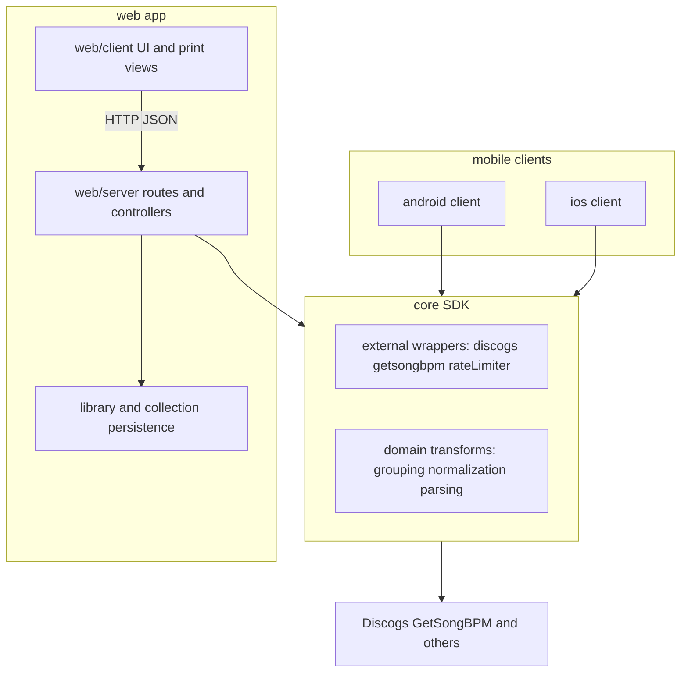

# System Overview

## Current Runtime

- `core/` holds Discogs/BPM (and related) wrappers, config, logging for services, and pure domain helpers.
- `web/` serves the browser UI, JSON API, library/collection persistence, and print views.
- Browser UI loads shared domain logic from `web/public/moozhak-domain.js` (kept in sync with `core/domain/library.js`).

## Mobile / Other Clients

- Consume `core` (e.g. `core/sdk.js`) locally; external calls go to Discogs, GetSongBPM, etc.—not to a separate “moozhak wrapper” HTTP service.

## Compatibility Commitments

- Web local library behavior remains supported.
- BPM card printing behavior remains supported.
- The legacy CLI has been removed; use the web app and/or `core` directly.

## Canonical Architecture Diagram

