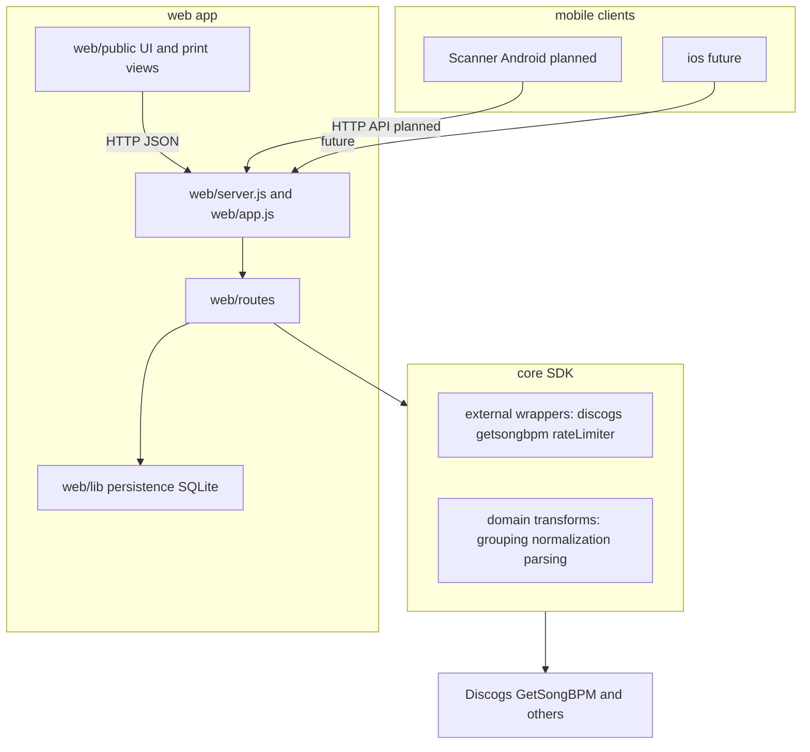

# System Overview

## Current Runtime

- `core/` holds Discogs/BPM (and related) wrappers, config, logging for services, and pure domain helpers.
- `web/` serves the browser UI, JSON API, library/collection persistence, and print views.
- Browser UI loads shared domain logic from `web/public/moozhak-domain.js` (kept in sync with `core/domain/library.js`).

### Web layout (concrete paths)

| Layer | Locations |
| ----- | --------- |
| Server entry | [web/server.js](../../web/server.js) |
| App factory (tests import this) | [web/app.js](../../web/app.js) |
| REST API | [web/routes/api.js](../../web/routes/api.js) |
| Persistence & logging | [web/lib/](../../web/lib/) (e.g. library/collection stores, SQLite under `web/lib/persistence/`) |
| Templates | [web/views/](../../web/views/) |
| Browser | [web/public/](../../web/public/) |

Runtime data defaults to the repo `data/` directory; override with `MOOZAK_DATA_DIR` in `.mzkconfig` or as an environment variable (env wins). Canonical store is SQLite (`moozhak.db` under that directory); JSON export/import remains for backups.

## Mobile / Other Clients

- **Scanner (Android, planned)** — stub and notes: [scanner/README.md](../../scanner/README.md). Expect HTTP to the web app’s `/api/*` (or a future extracted API); align behavior with **`core/`** as the contract reference (Node `core` is not embedded in the APK).
- **Other embedders** — may consume `core` (e.g. `core/sdk.js`) in Node; external calls go to Discogs, GetSongBPM, etc.—not to a separate “moozhak wrapper” HTTP service unless they choose to.

## Compatibility Commitments

- Web local library behavior remains supported.
- BPM card printing behavior remains supported.
- The legacy CLI has been removed; use the web app and/or `core` directly.

## Canonical Architecture Diagram

